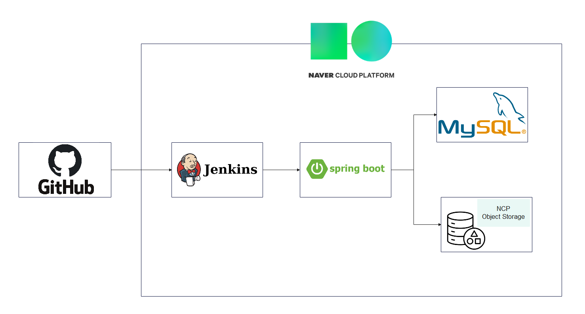
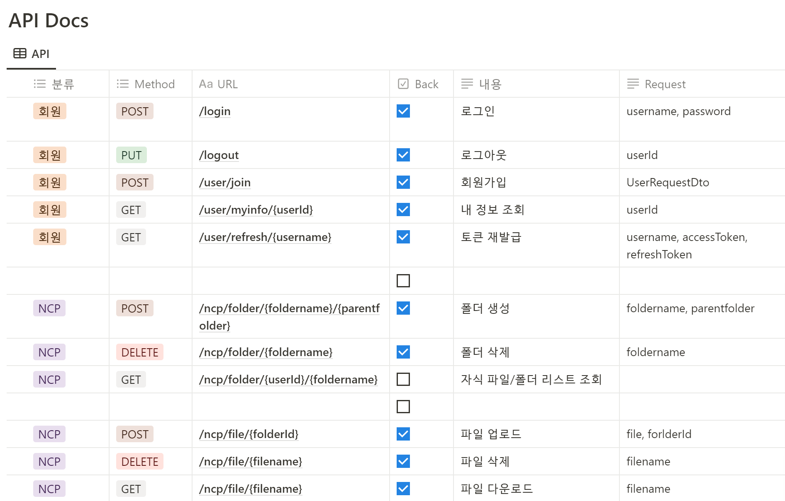
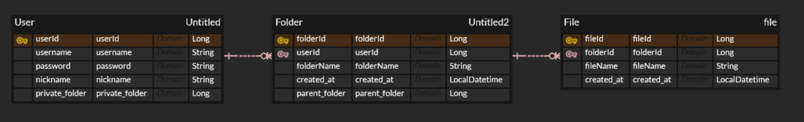

# Naver_MYBOX_Server

Numble에서 진행한 개인 프로젝트 " 네이버 마이박스 서버 만들기"

개인 노션 주소 : [](https://prickly-melon-45e.notion.site/MYBOX-d38a70c26e6e49f8a23a0daea86760c7?pvs=4)

---


## 기능 정의서

### 유저 API

- 유저 생성

- Spring Security, JWT를 활용한 로그인
- RefreshToken을 지우는 로그아웃
- Rsfresh Token 발급

- 유저 정보 조회(userId, nickname, privateFolderId)

  ```
  "username": "222",
  "nickname": "222",
  "privateFolder": 1
  ```

### 파일 API

- 기본 루트

  - 회원 가입시 기본적으로 개인 폴더 생성

  - 개인 폴더 속에 폴더, 파일을 생성, 업로드 등을 할 수 있음

  - DB, Storage에서 동일하게 진행됨

    > 추후 DB에서만 폴더 구조를 가지도록 할 예정

- 업로드
  - 폴더 속 파일 업로드 가능

- 다운로드
  - 폴더 속 다운로드 불가능

- 삭제
  - 폴더 속 파일 삭제 가능

### 폴더 API

- 생성
  - 폴더 속 폴더 생성 가능

- 삭제
  - 폴더 속 폴더 삭제 가능


## 아키텍처




## API 목록




## ERD




## 회고록

[MYBOX_Project_Notion](https://prickly-melon-45e.notion.site/1b00cb30d0044e23b0c964913944850c?pvs=4)


